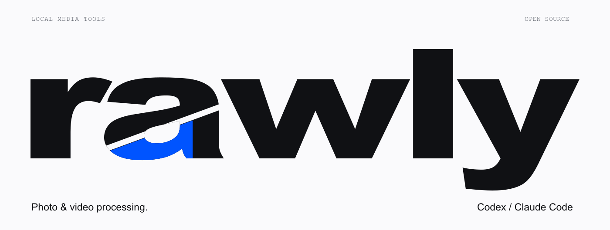

<div align="center">



<h3>Очистка метаданных · Обработка фото · Контроль над файлами</h3>

<p><strong>Другие языки</strong><br>
<a href="README.md">🇺🇸 English</a> · <a href="README.ru.md">🇷🇺 Русский</a></p>

<p>
<a href="LICENSE"></a>


<a href="https://github.com/exemble404/rawly/actions/workflows/ci.yml"></a>
</p>

<p><strong>Твои файлы. Твой компьютер. Твой процесс.</strong><br>
Локальная обработка фото и видео в виде навыка для Codex и Claude Code.<br>
Один файл или целая папка. Все оригиналы остаются на месте.</p>

<p><a href="#возможности">Возможности</a> · <a href="#как-это-работает">Как работает</a> · <a href="#установка">Установка</a> · <a href="#использование">Использование</a> · <a href="#структура">Структура</a></p>
</div>

---

## Зачем нужен Rawly

В медиафайле есть не только изображение: модель камеры, координаты, название
редактора и сведения о происхождении. Rawly переносит обработку на твой компьютер:
один навык, открытый код и понятный результат в отдельной папке.

Обработчик фото вырос из экспериментов с AI-детекторами. В открытой версии есть
принятый рецепт **D**, очистка метаданных и необязательные профили съёмки.
Без сервера, регистрации, подписки, загрузки моделей и запросов к детектору.
Доступ к самому Codex или Claude предоставляется через твой аккаунт агента.

## Возможности

| Возможность | Что делает | Реализация |
|---|---|---|
| Обработка полного кадра | Рецепт D, исходные размеры и прозрачность | Pillow + NumPy + OpenCV |
| Очистка видео | Убирает метаданные контейнера без перекодирования звука и видео | FFmpeg |
| Профили съёмки | Записывает выбранное устройство, локацию и время | ExifTool + JSON |
| Профиль из фото | Берёт поля камеры, без автоматического переноса GPS и старой даты | ExifTool |
| Обработка папок | Последовательная очередь и отдельный результат для каждого файла | Python stdlib |
| Защита оригиналов | Сохраняет новые файлы, отказывается перезаписывать существующие | Временные файлы + атомарная запись |
| Проверка метаданных | Показывает личные данные и поля происхождения | ExifTool |
| Навыки для агентов | `$rawly` в Codex, `/rawly` в Claude Code | Общий `SKILL.md` |

## Как это работает

```text
Файлы / папка
      │
      ├── Фото ───► поворот + sRGB ──► обработка D ──► новый PNG
      │                                                  │
      └── Видео ──► очистка метаданных, копирование потоков┤
                                                         ▼
                                             профиль съёмки, если выбран
                                                         │
                                                         ▼
                                              папка результата + отчёт
```

**Фото:** уменьшение каждой стороны до 50% методом Lanczos, возврат к исходным
размерам и монохромное зерно с адаптивной силой 4–7. Seed — `8501`.
Размер кадра сохраняется, но мелкие детали меняются и зерно остаётся видимым.

**Видео:** сжатые потоки звука и видео копируются. Метаданные контейнера, главы
и потоки данных удаляются. Кадры не генерируются заново.

## Установка

### 1. Системные инструменты

Для полного набора функций нужны Python **3.11+**, FFmpeg и ExifTool.

<details>
<summary><strong>macOS</strong></summary>

```bash
brew install python ffmpeg exiftool
```
</details>

<details>
<summary><strong>Ubuntu / Debian</strong></summary>

```bash
sudo apt-get update
sudo apt-get install python3 python3-venv ffmpeg libimage-exiftool-perl
```
</details>

### 2. Навык

```bash
git clone https://github.com/exemble404/rawly.git
cd rawly
python3 install.py --host both
```

Для одного агента укажи `--host codex` или `--host claude`. Установщик создаёт
отдельное Python-окружение для каждого навыка. Настройки агентов не меняет,
фоновые процессы не запускает. Повторный запуск обновляет установку.

| Агент | Папка навыка | Вызов |
|---|---|---|
| Codex | `~/.agents/skills/rawly` | `$rawly` |
| Claude Code | `~/.claude/skills/rawly` | `/rawly` |

После установки перезапусти сессию агента. Можно также установить папку
[`skills/rawly`](skills/rawly) через обычный установщик навыков — внутри есть
инструкции по подготовке зависимостей.

## Использование

В **Codex**:

```text
$rawly Обработай фото из ./input в ./output. Сохрани оригиналы.
```

В **Claude Code**:

```text
/rawly Обработай ./input в ./output с профилем ./studio.json.
```

Или опиши задачу своими словами. Профиль необязателен: без него Rawly не добавляет
в файл выдуманное устройство или местоположение.

### Без агента, из терминала

```bash
python3 skills/rawly/scripts/bootstrap.py
skills/rawly/.venv/bin/python skills/rawly/scripts/rawly.py doctor
skills/rawly/.venv/bin/python skills/rawly/scripts/rawly.py process ./input --output ./output
```

`--recursive` включает подпапки. Файлы обрабатываются по одному, платных уровней нет.
По умолчанию фото ограничены **24 мегапикселями**, чтобы
ограничить расход памяти. Пример имени результата: `photo.jpg.rawly.png`.
Существующие результаты не перезаписываются; отказ попадает в JSON-отчёт.

### Профили съёмки

```bash
skills/rawly/.venv/bin/python skills/rawly/scripts/rawly.py presets devices --search iPhone
skills/rawly/.venv/bin/python skills/rawly/scripts/rawly.py profile studio.json --device apple_0
skills/rawly/.venv/bin/python skills/rawly/scripts/rawly.py process ./input --output ./output --profile studio.json
```

Профили — обычные JSON-файлы, их количество не ограничено. Города, точное время,
часовые пояса и импорт полей камеры описаны в [справке](skills/rawly/references/profiles.md).

## Что означают результаты

Удаление метаданных и снижение оценки детектора по пикселям — разные операции.
Rawly не измеряет AI-процент, не загружает файлы на сторонние сервисы и не
подтверждает, что изображение снято указанной камерой.
В исторических пользовательских тестах D дал 0–1% на двух фото и 99% на пяти
других иллюстрациях. Это наблюдения, а не показатель точности на любых материалах.
Один удачный тест видео также не описывает поведение всех платформ.

Поддерживаются статичные JPEG, PNG, WebP, HEIC/HEIF, AVIF, TIFF, BMP и GIF;
контейнеры MP4, MOV и M4A. Анимации и многостраничные изображения отклоняются.
Очистка контейнера не стирает все сведения, встроенные в сжатые медиапотоки.
Основные платформы — macOS и Linux; обработка медиа в нативной Windows пока не проверена.

## Структура

```text
rawly/
├── skills/rawly/
│   ├── SKILL.md                  # инструкции для Codex и Claude
│   ├── agents/openai.yaml        # карточка навыка в Codex
│   ├── scripts/
│   │   ├── rawly.py              # командная строка
│   │   ├── bootstrap.py          # установка Python-зависимостей
│   │   └── rawly_core/           # D, метаданные, профили, пакетная обработка
│   ├── references/               # справка по установке и профилям
│   └── requirements.txt          # четыре Python-зависимости
├── assets/rawly-hero.svg          # оформление репозитория
├── tests/                        # тесты на синтетических материалах
├── install.py                    # установка и удаление навыков
└── .github/workflows/ci.yml       # автоматические проверки
```

Весь код обработки находится внутри навыка и выполняется локально.
Оба агента и CLI используют одну реализацию.

## Разработка

```bash
python3 skills/rawly/scripts/bootstrap.py
skills/rawly/.venv/bin/python -m unittest discover -s tests -v
```

Тесты создают материалы сами. Личных фото, ключей и логов в репозитории нет.
Перед изменением алгоритма прочитай [CONTRIBUTING.md](CONTRIBUTING.md).

## Удаление

```bash
python3 install.py --host both --uninstall
```

Удаляются установленные навыки и их Python-окружения. Результаты и профили,
сохранённые вне папок навыка, остаются на месте.

## Лицензия и благодарности

[MIT](LICENSE). Используются [Pillow](https://python-pillow.org/),
[NumPy](https://numpy.org/), [OpenCV](https://opencv.org/),
[FFmpeg](https://ffmpeg.org/) и [ExifTool](https://exiftool.org/).
Структура оформления вдохновлена [Z.A.E.B.A.L.](https://github.com/howdeploy/Z.A.E.B.A.L).
Иллюстрация и реализация Rawly находятся в этом репозитории.
